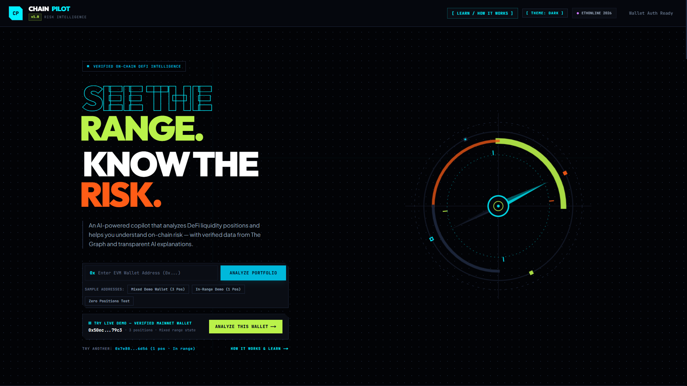
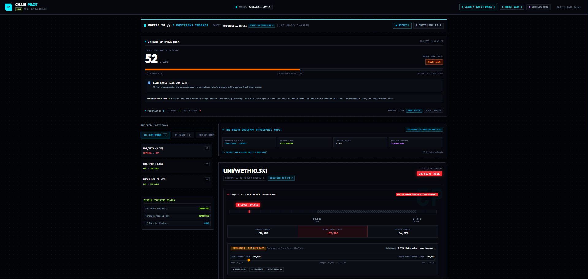
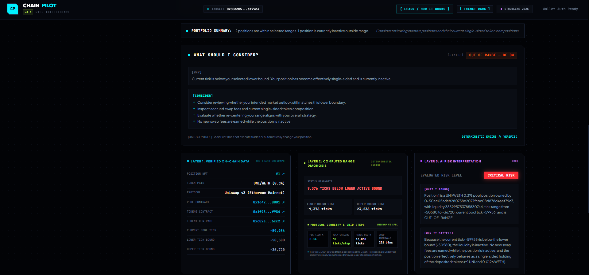
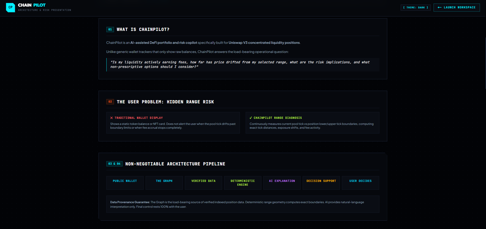

# ChainPilot 🧭

> **An AI-Assisted DeFi Position & Risk Copilot for Uniswap V3 Liquidity Providers**

ChainPilot is an intelligent, read-only decision-support copilot designed specifically for **Uniswap V3 concentrated liquidity providers (LPs)**. It translates complex on-chain telemetry, tick boundary geometry, and indexer data into plain-English risk evaluations, deterministic decision considerations, and verifiable protocol provenance.

ChainPilot is **not an autonomous trading bot** and **does not execute transactions or modify wallet state**. The user remains 100% in control of all liquidity decisions.

---

## 💡 What is ChainPilot?

Uniswap V3 introduced **Concentrated Liquidity**, allowing LPs to allocate capital within custom price ranges $[t_{\text{lower}}, t_{\text{upper}}]$. While capital efficiency increased up to $4000\times$, it introduced an operational challenge: **range health monitoring**.

When market price drifts outside an LP's selected tick interval:
- Swap fee accumulation immediately drops to **zero**.
- Position inventory converts **100% into the single outperforming token**.
- Capital sits idle until the price returns or the LP manually rebalances.

ChainPilot bridges the gap between raw blockchain data and user understanding by combining **load-bearing indexer queries (The Graph)**, **pure deterministic range math**, and **data-grounded AI narratives**.

---

## 🎯 Why ChainPilot? (The Problem)

Knowing that an LP position exists is not enough. LPs need immediate, verifiable answers to four operational questions:

1. **Range Alignment**: Is the current pool tick inside or outside my position bounds?
2. **Boundary Proximity**: How close is the current tick to my lower or upper price boundary?
3. **Fee Health**: Is the position currently active and earning swap fees, or inactive?
4. **Portfolio Impact**: How does out-of-range drift across individual positions affect overall portfolio risk?

ChainPilot provides objective measurements and AI explanations without relying on unverified financial claims or automated transaction execution.

---

## ✨ Core Features

- **Public Ethereum Wallet Analysis**: Analyze any public Ethereum address without connecting a wallet or exposing private keys.
- **Live Uniswap V3 Data via The Graph**: Discovers active position NFTs (`liquidity > 0`), pools, ticks, and token metadata through live GraphQL queries.
- **Deterministic LP RANGE RISK Scoring**: Evaluates portfolio health on a transparent 0–100 scale (`LOW`, `MODERATE`, `HIGH`, `CRITICAL`).
- **Deterministic Range & Protocol Geometry**:
  - Range Width ($W$) and Relative Position Ratio ($P$).
  - Boundary distance percentages ($15\%$ threshold for `NEAR_LOWER` / `NEAR_UPPER`).
  - Fee percentage mapping ($0.01\%$, $0.05\%$, $0.3\%$, $1.0\%$).
  - Standard protocol tick step spacing ($\Delta t \in \{1, 10, 60, 200\}$).
  - Total protocol grid step bins ($N_{\text{bins}} = W / \Delta t$).
- **Interactive Tick Drift Simulator**: Drag the simulated current tick to observe dynamic updates in range state, risk scores, and decision considerations in real time.
- **Multi-Provider AI Resilience Engine**:
  - Primary: **Groq API** (`openai/gpt-oss-120b`) with strict JSON Schema enforcement.
  - Fallback: **Google Gemini API** (`models/gemini-3.6-flash`).
  - Offline Fallback: Deterministic narrative generation if AI providers are unavailable.
- **2-Pillar Data-Grounded AI Explanations**: Structured output separating `[WHAT I FOUND]` (verified facts) from `[WHY IT MATTERS]` (operational impact).
- **The Graph Gateway Provenance Inspector**: Load-bearing transparency panel displaying deployment ID (`5zvR82Q...`), HTTP status (`200 OK`), latency (ms), timestamp, indexed position count, sanitized endpoint URL, and expandable raw GraphQL query document.
- **Substantive Uniswap V3 Ecosystem Actions**: Read-only direct linkouts to `[MANAGE ON UNISWAP]`, `[UNISWAP POOL INFO]`, `[NFT MANAGER CONTRACT]`, and `[V3 FACTORY CONTRACT]`.
- **Etherscan Verification & Native ETH Balance Audit**: Verifies wallet and token contracts directly on Etherscan and audits native ETH balances via JSON-RPC.
- **Zero-Position Wallet Safety**: Clean empty-state handling with protocol contract provenance links for wallets holding 0 active V3 positions.
- **Dual Cyberpunk & Light Theme System**: Full dark mode and light mode interface options.
- **Interactive `/learn` Educational Route**: 12 progressive educational sections explaining concentrated liquidity, tick math, indexer architecture, and risk model boundaries.

---

## 🖼️ Screenshots

| Screenshot | Description | Path |
| :--- | :--- | :--- |
| **Landing Hero (Dark)** | Tactical dark mode landing page with instant address input & live demo CTA | `docs/screenshots/landing-dark.png` |
| **Landing Hero (Light)** | Clean light mode landing page layout | `docs/screenshots/landing-light.png` |
| **Risk Workspace** | Dominant position card, 0–100 LP RANGE RISK score gauge, and position visualizer | `docs/screenshots/workspace-dark.png` |
| **AI Risk Summary & Provenance** | Data-grounded 2-pillar AI risk explanation (`whatIFound` / `whyItMatters`) and Subgraph evidence audit | `docs/screenshots/ai-summary-dark.png` |
| **How It Works & Graph Audit** | Interactive 4-layer architecture diagram and raw Subgraph Gateway query audit panel | `docs/screenshots/how-it-works.png` |

<br />









---

## 🏗️ How It Works (4-Layer System Journey)

```
PUBLIC ETHEREUM WALLET ADDRESS
        │
        ▼
LAYER 1 — VERIFIED DATA (The Graph Subgraph Gateway)
        │ • Live GraphQL position query (Deployment: 5zvR82Q...)
        │ • Sourced protocol facts: ticks, pool address, feeTier, liquidity
        ▼
LAYER 2 — DETERMINISTIC ENGINE (Pure TypeScript Math)
        │ • Range width W, ratio P, distance percentages
        │ • Proximity states: OUT_BELOW, OUT_ABOVE, NEAR_LOWER, NEAR_UPPER, CENTERED
        │ • Protocol geometry: Fee %, tick spacing Δt, grid bins N_bins
        │ • Deterministic LP RANGE RISK Score (0–100) & "WHAT SHOULD I CONSIDER?"
        ▼
LAYER 3 — DATA-GROUNDED AI EXPLANATION (Groq / Gemini)
        │ • Explains verified data without hallucinating unverified claims
        │ • Outputs 2 Pillars: [WHAT I FOUND] & [WHY IT MATTERS]
        ▼
LAYER 4 — USER DECISION SUPPORT (Read-Only)
        │ • Neutral risk summary & evidence citations
        │ • Direct read-only linkouts to Uniswap App & Etherscan
        ▼
USER EXECUTES DECISION ON EXTERNAL INTERFACES
```

---

## 📊 Risk Model: LP RANGE RISK

ChainPilot calculates a deterministic **LP RANGE RISK Score** ($0 - 100$) evaluating portfolio exposure to out-of-range fee loss:

| Risk Score | Level | Operational Meaning |
| :---: | :---: | :--- |
| **$0 - 25$** | `LOW` | All positions centered inside selected tick boundaries ($15\%+ \text{ distance from bounds}$). |
| **$26 - 55$** | `MODERATE` | Current tick is approaching range boundaries ($< 15\% \text{ distance to bounds}$). |
| **$56 - 85$** | `HIGH` | One or more positions have moved outside active tick bounds (`OUT_BELOW` or `OUT_ABOVE`). |
| **$86 - 100$** | `CRITICAL` | Severe tick drift across multiple positions; swap fee accumulation fully halted. |

### Explicit Risk Model Scope Boundary
To ensure mathematical integrity, the **LP RANGE RISK Score strictly evaluates range health and tick proximity**. It does **NOT** estimate or claim:
- ❌ Dollar USD loss values
- ❌ Impermanent loss ($IL$) dollar values
- ❌ Liquidation risk (Uniswap V3 spot positions are non-borrowed concentrated liquidity)
- ❌ Historical cumulative time spent out of range
- ❌ Uncollected accrued swap fee values

---

## 🛡️ AI Safety & Data Grounding

ChainPilot enforces a strict **Zero-Hallucination Policy**:
- **Blockchain Truth from Data Layer**: Verified facts originate strictly from server-side Subgraph queries.
- **Math from Deterministic Engine**: Scores, range ratios, and decision considerations are computed independently of AI.
- **AI Explains Verified Data**: The AI engine receives verified position telemetry and translates it into natural language.
- **Wording Blacklist**: System prompts prohibit claiming *"0 swap fees"*, *"tokens locked as X"*, *"balanced 50/50 exposure"*, or invented USD valuations.
- **Resilient Fallback**: If AI API keys are unconfigured or rate-limited, ChainPilot falls back to deterministic explanations without breaking UI state.

---

## 🌐 Data Source: The Graph Subgraph Gateway

ChainPilot relies on **The Graph Subgraph Gateway** as its primary decentralized indexing layer:
- **Subgraph**: Official Uniswap V3 Ethereum Mainnet Subgraph
- **Deployment ID**: `5zvR82QoaXYFyDEKLZ9t6v9adgnptxYpKpSbxtgVENFV`
- **GraphQL Query**: Filtered by wallet owner address and `liquidity > 0`.
- **Query Audit Inspector**: Exposes deployment ID, HTTP status (`200 OK`), query latency (ms), execution timestamp, and sanitized endpoint URL (`https://gateway.thegraph.com/api/[SUBGRAPH_KEY_CONFIGURED]/...`).

---

## 🛠️ Technology Stack

- **Framework**: Next.js `16.3.4` (App Router, RSC, Turbopack), React `19.2.8`, TypeScript `^5`
- **Styling**: Tailwind CSS `^4` with CSS Custom Variables
- **Data Indexing**: The Graph Subgraph Gateway (`5zvR82QoaXYFyDEKLZ9t6v9adgnptxYpKpSbxtgVENFV`)
- **Blockchain Telemetry**: Native EVM JSON-RPC over PublicNode (`ethereum-rpc.publicnode.com`) / 1RPC (`1rpc.io/eth`)
- **AI Providers**: Groq API (`openai/gpt-oss-120b`) primary, Google Gemini API (`models/gemini-3.6-flash`) fallback
- **Authentication**: Privy (`@privy-io/react-auth ^3.40.0`)

---

## 📁 Project Structure

```text
chainpilot/
├── app/
│   ├── api/
│   │   ├── analyze/                  # Main analysis route (Graph fetch + AI multi-provider)
│   │   └── balance/                  # EVM JSON-RPC native ETH balance fetcher
│   ├── components/                   # React presentation & interactive components
│   │   ├── AIRiskCard.tsx            # Position risk display, protocol geometry & direct links
│   │   ├── GraphProvenancePanel.tsx  # The Graph load-bearing transparency & query audit panel
│   │   ├── LiquidityRangeVisualizer.tsx # Range math & interactive tick simulator
│   │   ├── RiskScoreGauge.tsx        # 0–100 deterministic risk gauge component
│   │   ├── DashboardClient.tsx       # Main client state coordinator & zero-position view
│   │   ├── AddressInput.tsx          # Address validator & preset demo buttons
│   │   ├── PrivyAuthButton.tsx       # Privy wallet connect & address auto-sync
│   │   └── LearnContent.tsx          # /learn progressive educational guide component
│   ├── learn/                        # Educational /learn route
│   ├── globals.css                   # Tactical design tokens & CSS custom variables
│   └── page.tsx                      # Server component root layout shell
├── docs/
│   └── screenshots/                  # Curated GitHub README screenshots (.gitkeep)
├── lib/
│   ├── ai/                           # AI provider pipeline & prompt contracts
│   │   ├── provider.ts               # Groq -> Gemini -> Fallback evaluation engine
│   │   ├── prompts.ts                # System prompt & strict data-grounding rules
│   │   └── types.ts                  # Risk level, evidence, and response schemas
│   ├── decision/                     # Pure deterministic engines
│   │   ├── decisionEngine.ts         # Layer 2 "WHAT SHOULD I CONSIDER?" engine
│   │   ├── protocolGeometry.ts       # Fee tier % & tick spacing step calculator
│   │   ├── rangeGeometry.ts          # Pure range width W & relative ratio P calculator
│   │   └── riskCalculator.ts         # Deterministic 0-100 LP RANGE RISK score calculator
│   ├── graph/                        # Subgraph Gateway client & GraphQL queries
│   │   ├── client.ts                 # fetchUniswapPositions() & performance tracker
│   │   └── types.ts                  # Raw & normalized Graph position contracts
│   └── utils/                        # Explorer helpers & EVM address utilities
├── .env.example                      # Server-side API key configuration template
├── package.json                      # Dependencies & build scripts
└── README.md                         # Product documentation
```

---

## 🚀 Local Environment Setup

### Prerequisites
- **Node.js**: 20+
- **npm**: 10+

### Step-by-Step Instructions

1. **Clone the Repository**:
   ```bash
   git clone https://github.com/R1shabhCodes/ChainPilot.git
   cd chainpilot
   ```

2. **Install Dependencies**:
   ```bash
   npm install
   ```

3. **Configure Environment Variables**:
   Copy `.env.example` to `.env.local`:
   ```bash
   cp .env.example .env.local
   ```
   Add your server-side API keys to `.env.local`:
   ```env
   # Groq AI Engine Key (Primary)
   GROQ_API_KEY="your_groq_api_key_here"
   GROQ_MODEL="openai/gpt-oss-120b"

   # Google Gemini API Key (Fallback)
   GEMINI_API_KEY="your_gemini_api_key_here"

   # The Graph Subgraph API Key
   THE_GRAPH_API_KEY="your_the_graph_api_key_here"

   # Privy Auth App ID (Client-visible)
   NEXT_PUBLIC_PRIVY_APP_ID="your_privy_app_id_here"
   ```

4. **Run Development Server**:
   ```bash
   npm run dev
   ```
   Open [http://localhost:3000](http://localhost:3000).

5. **Build for Production**:
   ```bash
   npm run build
   ```

---

## 🧪 Verified Demo & Test Addresses

For evaluation and testing, use these preset mainnet addresses:

- **3-Position Verified LP Demo Wallet**:
  `0x50ec05ade8280758e2077fcbc08d878d4aef79c3`
  - Position #1: UNI/WETH (0.3% fee, NFT #1)
  - Position #2: DAI/USDC (0.05% fee, NFT #5)
  - Position #3: USDC/USDT (0.05% fee, NFT #8)

- **Zero-Position Test Wallet**:
  `0x1111111111111111111111111111111111111111`
  - Demonstrates clean zero-position status, protocol contract links, and Subgraph audit panel execution.

---

## 🔒 Safety & Scope Boundary

- **Read-Only Analysis**: ChainPilot does not require transaction signing or private key access.
- **No Transaction Execution**: ChainPilot does not submit trades, rebalances, or token approvals.
- **Not Financial Advice**: ChainPilot is an educational and decision-support risk copilot.

---

## 🏆 Hackathon & Sponsor Integrations

- **The Graph**: Load-bearing indexer querying the official Uniswap V3 Mainnet Subgraph (`5zvR82Q...`) to discover active NFT positions via GraphQL. Includes live latency, status code, and query document transparency.
- **Uniswap V3**: Structural liquidity integration calculating range ratio $P$, concentration width $W$, fee tier %, standard tick step spacing ($\Delta t$), and protocol step bins ($N_{\text{bins}}$), with direct linkouts to official Uniswap pool and position interfaces.
- **Privy**: Integrated embedded wallet authentication layer providing seamless address auto-sync for public portfolio analysis.

---

## 📄 License

MIT License. See [LICENSE](LICENSE) for details.
